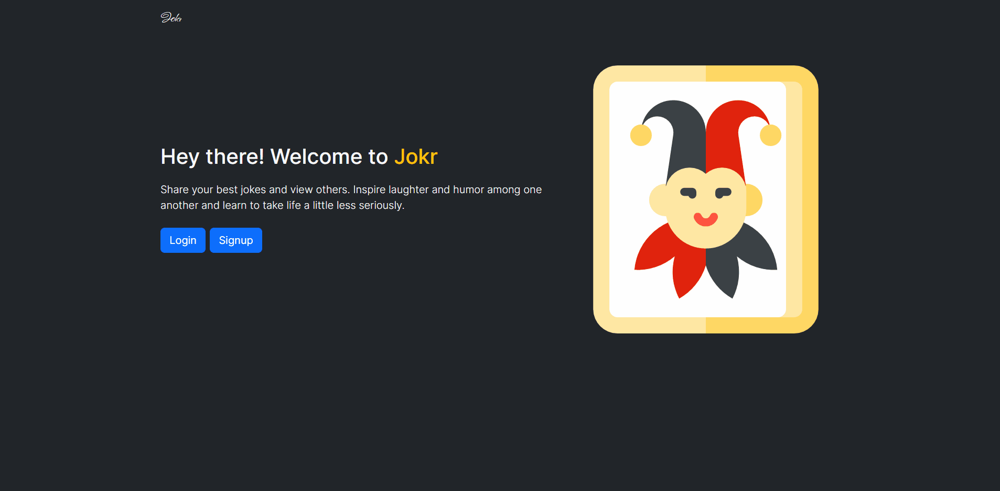

# Introduction

This is a Full-stack joke sharing app called Jokr. I built this app using the MVC Architecture to organize and structure my code. I have also implemented "authorization" so users can sign up, and keep track of the jokes they post. 

---

# Technologies

For this app I used Node.js, Express.js, Javascript, MongoDB, Mongoose, EJS, and Bootstrap for styling.

---

# Objectives

- I created this app to better understand the MVC concept and how logins are added

---

# Packages/Dependencies used 

bcrypt, connect-mongo, dotenv, ejs, express, express-flash, express-session, mongodb, mongoose, morgan, nodemon, passport, passport-local, validator

---

